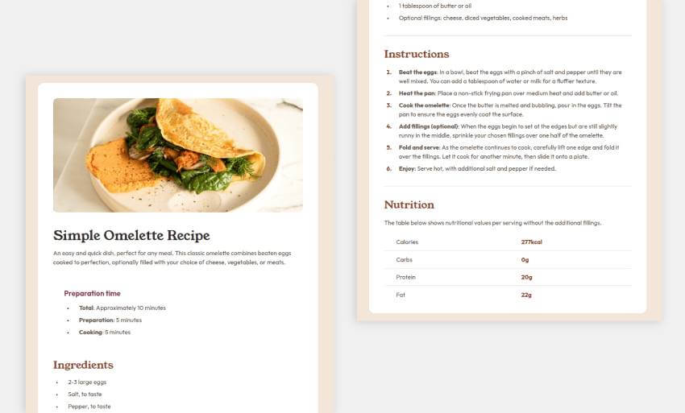
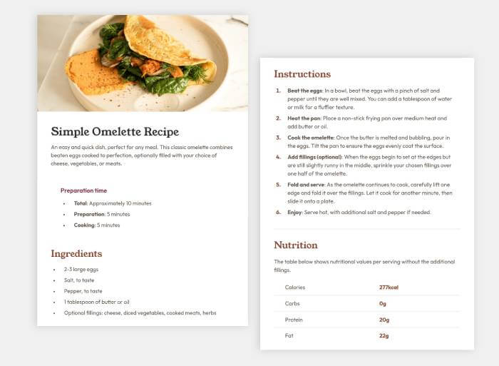

# Frontend Mentor - Recipe page solution

This is a solution to the [Recipe page challenge on Frontend Mentor](https://www.frontendmentor.io/challenges/recipe-page-KiTsR8QQKm). Frontend Mentor challenges help you improve your coding skills by building realistic projects.

## Table of contents

- [Overview](#overview)
  - [The challenge](#the-challenge)
  - [Screenshot](#screenshot)
- [My process](#my-process)
  - [Built with](#built-with)
  - [What I learned](#what-i-learned)
  - [Continued development](#continued-development)
  - [Useful resources](#useful-resources)
- [Author](#author)

## Overview

### Screenshots

**Large Screens**


**Small Screens**


### Links

- [GitHub Repo](https://github.com/amShuri/recipe-page)
- [GitHub Live](https://amshuri.github.io/recipe-page/)

## My process

### Built with

- Semantic HTML5 markup
- CSS custom properties
- Flexbox

### What I learned

I explored the CSS clamp() function to handle responsive font sizes without relying on multiple media queries. For example, my `<h1>` scales with the viewport but never goes below 2rem or above 2.5rem:

```css
.recipe__title {
  font-size: clamp(2rem, 2.5vw, 2.5rem);
}
```

This approach isn’t a pixel-perfect solution but keeps the typography flexible and very close to the original design.

### Continued development

I want to continue exploring the clamp() function since it’s still a bit confusing. In particular, I’m not fully sure how the middle value behaves. My goal is to get more comfortable with it, because it seems very useful for responsive design.

### Useful resources

- [clamp() on MDN](https://developer.mozilla.org/en-US/docs/Web/CSS/clamp) - I used MDN to read about the clamp() function.

## Author

- Website - [amShuri](https://github.com/amShuri)
- Frontend Mentor - [@amShuri](https://www.frontendmentor.io/profile/amShuri)
- Twitter - [@amshuri7](https://x.com/amshuri7)
